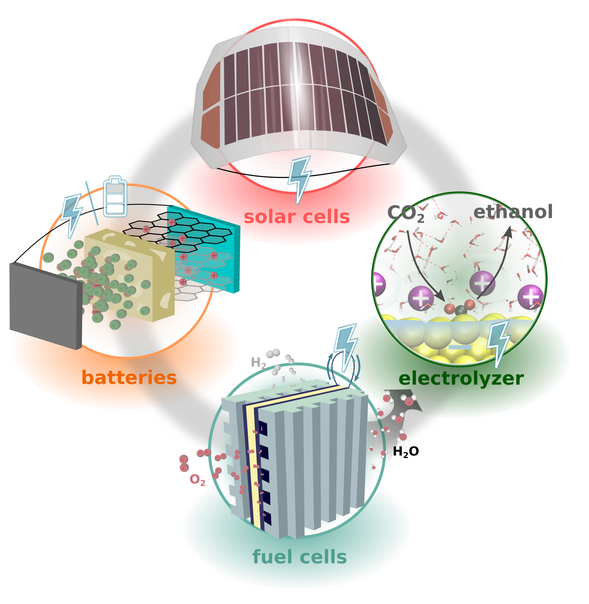

# Research interest and motivation

<figure>
  
  <figcaption> Our research focuses on machine learning assisted, first-principles and <i>in operando</i> design of energy conversion (electrolyzers, fuel cells), energy harvesting (solar cells) and energy storage (batteries) materials.</figcaption>
</figure>

Our world today is facing an unprecedented environmental challenge, with the energy demand steadily increasing, the CO2 concentration in the atmosphere reaching record-high levels in the human history, and oil, gas and coal being estimated to last for around 50--100 years. The already initiated global drive towards renewable energies is limited by an efficient and carbon-neutral conversion and storage of electrical and chemical energy. A central role is played by the electrochemical reduction of the greenhouse CO2 gas (CO2R), which offers an environmentally highly valuable route to fuels, but is still not economically feasible due to catalysts exhibiting high overpotentials and poor product selectivity.  At the same time, hydrogen gas, which is essential for the chemical industry, is almost exclusively harvested via carbon-intensive steam reforming. The sustainable alternative, electrochemical water splitting, is again limited by high overpotentials making the process economically intractable. The recent environmental changes have, however, increased the political and economic momentum towards carbon-neutral harvesting and conversion of energy. 

The main focus of our research group is the computational discovery of economically competitive energy conversion and storage systems, comprising solar cells, batteries, capacitors, fuel cells and electrolyzers. The central challenge is to develop a much more directed and systematic material screening framework based on detailed physical and chemical understanding of the processes and their reaction environment. In particular in the field of electrocatalysis, the discovery of increasingly more complex, nano-structured and multi-component active catalysts has significantly decreased scientific comprehension and lead to a critically high level of experience- and trial-and-error-based search for new materials. Simulations can help in increasing the scientific component in the search for new materials, but are required to be accurate on multiple scales and consider the actual <i>operando</i> environmental conditions of the materials. 
